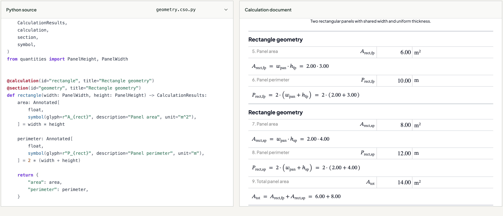

<h1 align="center">CalculationSourceObject</h1>

<p align="center">
  Turn Python calculations into audit-ready engineering reports with formulas, unit tracking, and verified results.
</p>

<p align="center">
  One single source for code and documentation—automatically validated before HTML or PDF export.
</p>

## Quickstart

Give your coding agent this prompt:

> Run `npx create-cs-object@latest my-calculation`, then show me something
> extraordinary about an ordinary object. Use at most ten formulas and let me
> experiment with the inputs.

**[Explore the worked example](https://www.cs-object.com/examples)** ·
[See the agent workflow](https://www.cs-object.com/docs)

## How it works

[](assets/readme-demo.png)

Whether you currently use Excel, calculation software or Python, start with the
problem you need to solve. You can work with a coding agent or write the source
yourself.

1. Describe the problem, inputs, units and assumptions.
2. Your agent writes a Python calculation with named quantities, formulas,
   explanations and figures.
3. CSO runs the calculation, checks its documented formulas against the Python
   results, and generates the report from that same captured execution.
4. Your agent inspects the HTML report during development and the final pages
   when delivering a PDF. You review the inputs, assumptions,
   method and results against the problem.

When something changes, update the calculation source and regenerate the report.
The formulas do not need to be copied into a second document.

## Safeguards for agent-written calculations

The report must faithfully show what the code calculated. CSO derives the
documented formulas from the Python source and evaluates them separately to
check that their values agree with Python's results. Failed consistency checks
stop PDF publication.

The PDF workflow also checks that document content is retained and mathematical
notation fits the page width. By default, it saves verification records tied to
the exact PDF, so you can identify the source, inputs and checks behind it.

You can supply independently established reference results for an additional
numerical check. The reports distinguish successful, failed and inapplicable
checks. The [CLI guide](packages/cso-cli/README.md) explains their scope.

These safeguards establish agreement between the calculation and its document.
An engineer still reviews whether the inputs, assumptions, units and method are
appropriate. Page-by-page visual inspection remains a separate check.

## Write once, reuse across projects

Keep common calculations in Python modules and compose them into larger
calculations. Reuse their quantity definitions, units and notation alongside
their formulas.

The [two-panel example](examples/two-panel/README.md) calls the same
[rectangle calculation](examples/two-panel/geometry.cso.py) with different inputs:

```python
from _cso_bindings.geometry import rectangle

first_panel = rectangle(width=width, height=first_panel_height)
second_panel = rectangle(width=width, height=second_panel_height)
```

The generated report shows both calculations with distinct symbols and results.
The [parent calculation](examples/two-panel/estimate.cso.py) adds their areas and
passes the total to a reusable material calculation for volume and mass.

Generate `_cso_bindings` from the authored functions before importing them;
[setup](docs/development.md#setup) prepares the maintained examples. The
[two-panel walkthrough](examples/two-panel/README.md) explains the complete
define, generate, import and call workflow. The
[section-property comparisons](examples/section-properties/README.md#reuse-in-a-comparison)
apply it to larger calculations while retaining their documented intermediates.

## Use Python's scientific libraries

Use Python's mathematical and scientific libraries within your calculations.
Include mathematical steps where they can be represented as formulas. For
complex computations better explained in words, document the method, inputs
and results, with figures where they help the reader follow the work.

Your calculation can combine readable equations with specialised numerical
methods in one report.

## Create a local report project

The [initializer](packages/create-cs-object/README.md) creates a standalone project
with a Python calculation and a browser app. It requires Node 24 and Python 3.11+.
After the `0.1.0` packages are published, create and start a project with:

```sh
npm create cs-object my-report
cd my-report
npm run dev
```

The initializer installs the JavaScript dependencies, a project Python environment,
and Chromium for PDF generation. Your coding agent edits the calculation and its
brief. The local app derives editable inputs from that calculation, verifies API
results on the server, and offers its report as HTML and PDF.

The packages are prepared for release; this repository does not establish their
availability on npm or PyPI. [Installed-package acceptance](tests/integration/README.md)
tests the generated experience using actual archives before publication.

## Start your first calculation

Open this repository in your coding agent and start with a prompt such as:

> Set up CalculationSourceObject using its development guide. Create a calculation
> for [describe the problem], using [inputs and units] and [assumptions]. Read the
> authoring guide and reuse existing calculations where appropriate. Ask me about
> missing inputs or assumptions. Verify the calculation and inspect its HTML
> report, using browser layout checks. Return the source, HTML and check results.
> If I request a PDF, inspect its final pages before delivery. Report what passed, failed
> or was not checked.

For local setup, use Node 24 LTS and Python 3.11+. Follow the
[setup guide](docs/development.md#setup), which includes the Python package,
CLI and browser required for PDF generation. Then check the worked example
from the repository root:

```sh
node packages/cso-cli/dist/cli.js verify examples/two-panel/estimate.cso.py \
  --function estimate --input width=2 \
  --reference examples/two-panel/reference.json --format json
```

The [CLI guide](packages/cso-cli/README.md) covers HTML/PDF generation and verification
reports. To explore the example locally, run `npm run dev` after setup.

## Project status and documentation

CSO is a prototype, currently at version `0.1.0`. The `.cso.py` authoring format
and APIs can change during `0.x` development. Pin package versions and rerun
verification after upgrades.

- [Authoring guide](docs/authoring.md)
- [Python library](packages/cso-python/README.md),
  [core library](packages/cso-core/README.md) and
  [React components](packages/cso-react/README.md)
- [CLI](packages/cso-cli/README.md) and
  [project initializer](packages/create-cs-object/README.md)
- [Local demo](apps/demo/README.md)
- [Development and checks](docs/development.md), [code map](docs/code-map.md) and
  [agent guidance](AGENTS.md)
- [Domain terms](CONTEXT.md), [document rendering](docs/rendering.md) and
  [design decisions](docs/adr/)
- [Contributing](CONTRIBUTING.md), [code of conduct](CODE_OF_CONDUCT.md) and
  [security policy](SECURITY.md)

Licensed under [Apache-2.0](LICENSE). See [NOTICE](NOTICE) and package third-party
notices for attribution.
